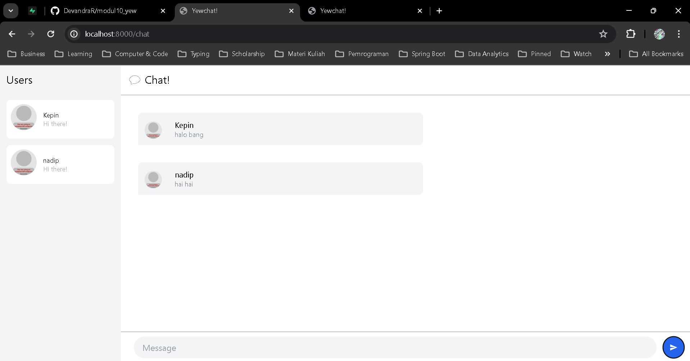

# 3.1. Original Code

<h3>Chat 1</h3>

<h3>Chat 2</h3>

<h3>Terminal Client</h3>

<h3>Terminal Server</h3>

# 3.2. Add some creativites to the web client

<h3>Add Some Creativity</h3>
Telah ditambahkan counter untuk jumlah chat pada halaman chat utama, namun hanya bisa dilihat orang baik

